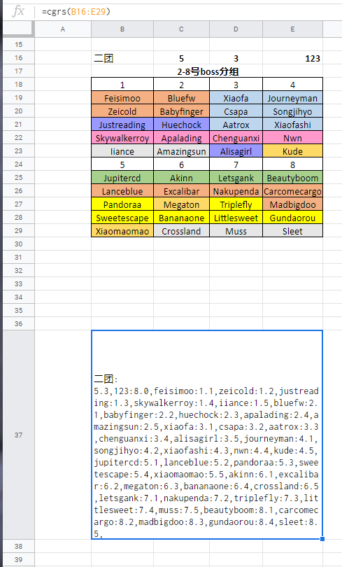

# CG Raid Setup

1. Setup raid groups.
2. One button to invite players 
3. One button to rearrange groups.

## Import raid layout from google sheet

### Step 1: Create your raid layout as below.

#### B16: setup name
Name of this setup
#### C16: member rank
The integer value of the raid member's rank in guild, C16 in this example
#### D16: minimum officer rank
The integer value of the minmium raid leaders rank, e.g. class leader rank, officer rank, D16 in this example
#### E16: invite prefix
When a player whisper this keyword to you, you will invite him/her for this raid setup, E16 in this example
#### B17:E17: comment
The description of this setup, not used at this moment.
#### B18:E29: raid setup
Raid setup layout
#### B37: import string
Copy the content of this cell to __CG Raid Setup Import__'s import string
=cgrs(B16:E29)
The function is in CGRS.gs use the content as a [custom function for google sheet](https://developers.google.com/apps-script/guides/sheets/functions)

